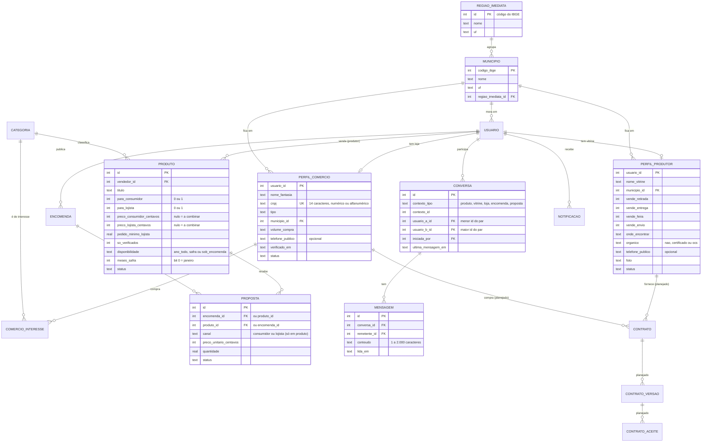
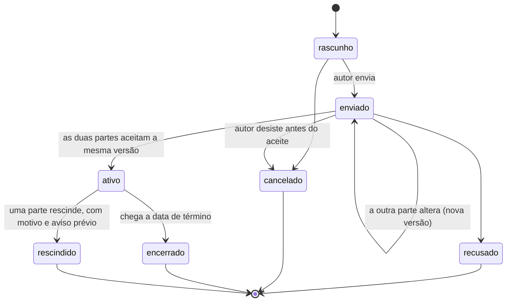

# Visão v2: produtor, comércio e consumidor final

> Documento de engenharia da revisão de escopo de outubro de 2026. Complementa a pesquisa do projeto e o [benchmark de marketplaces](benchmark-marketplaces.md). Os dados de demonstração citados aqui são fictícios.

## 1 Por que o escopo mudou

O AgroEncomenda começou como um marketplace genérico do agro, com anúncios de produção, animais, máquinas, insumos e serviços. Em 6 de outubro de 2026 o grupo redefiniu o objetivo:

- **ligar quem produz**, do pequeno ao grande produtor, a **comércios e intermediários** (mercados, restaurantes, distribuidores, cooperativas, agroindústrias) e ao **consumidor final**;
- **não vender** nada nem intermediar pagamentos;
- ajudar o produtor a **vender mais**, a **fechar contratos de fornecimento** e a ser encontrado pelos comércios da **sua região**;
- dar ao consumidor acesso direto ao que se produz perto dele.

Decisões tomadas na revisão:

| Decisão | Escolha |
|---|---|
| Quem vê o preço para lojas | Quem tem perfil de comércio com **CNPJ válido**. O produtor pode exigir comércio **verificado** em cada produto (Iteração 4) |
| Categorias | Só o que se produz no campo. Saem máquinas e insumos. Ficam produção agrícola, pecuária, produtos de origem animal, processados e artesanais e serviços rurais |
| Prazo | 2 a 4 semanas. Perfis, preço por público, conversas e contratos completos. Administração mínima |

## 2 Papéis: uma conta, até três papéis

A decisão da pesquisa de **perfis não exclusivos** continua: a mesma conta pode ter os três papéis. Por exemplo, um empório pode comprar de produtores (comércio) e também vender a própria geleia (produtor).

| Papel | Como obtém | O que ganha |
|---|---|---|
| Consumidor | Qualquer conta | Vê os produtos vendidos ao consumidor final, com o preço de consumidor. Faz pedidos |
| Produtor | Cria a **vitrine** (perfil de produtor). É exigida para cadastrar produtos | Página pública com o que produz, como vende e onde encontrar. Vê o diretório de comércios |
| Comércio | Cadastra a **loja** (perfil de comércio) com CNPJ válido | Aparece para os produtores da região, com o que compra e quanto. Vê os preços para lojas e o pedido mínimo, e pede cotações. Pode trocar para "Ver como consumidor" |

No cadastro, a pessoa marca como vai usar o sistema (vender, comprar para o comércio, comprar para consumo) e já é levada a criar a vitrine e/ou a loja.

## 3 Regras de negócio

| Código | Regra | Onde está no código |
|---|---|---|
| RN01 | Só cadastra produtos quem tem vitrine de produtor. Sem vitrine, o sistema leva para criar a vitrine e depois volta ao cadastro do produto | `app/produtos/routes.py` (`novo`) |
| RN02 | A vitrine precisa de pelo menos uma forma de venda. Quem marca "feira ou ponto fixo" informa onde e quando | `app/perfis/forms.py` |
| RN03 | Produção orgânica só pode ser declarada com certificadora ou OCS informada. A vitrine mostra "(declarado)", porque a plataforma não confere o registro | `app/perfis/forms.py`, `vitrine.html` |
| RN04 | O CNPJ do comércio é conferido pelo dígito verificador, nos formatos numérico e alfanumérico, e não pode se repetir entre contas. Trocar o CNPJ tira o selo de verificado | `app/cnpj.py`, `app/perfis/dados.py` |
| RN05 | Telefone público é **opcional** e decidido pelo próprio usuário (consentimento). O padrão continua sendo a regra D13: contato só depois do aceite da proposta | `app/perfis/forms.py` |
| RN06 | Dados dos comércios (página e diretório) aparecem só para quem tem vitrine de produtor, para a própria loja e para a administração. Evita raspagem de contatos e garante que a loja seja procurada por quem tem o que vender | `app/perfis/routes.py` (`produtor_obrigatorio`) |
| RN07 | Produto de origem animal exige o serviço de inspeção. A página do produto mostra até onde ele pode ser vendido (ver seção 6.1) | `app/seed.sql` (atributo 6), `app/inspecao.py` |
| RN08 | Busca e diretórios ordenam por proximidade: mesmo município, mesma região imediata, mesma UF, depois o resto. Não há GPS: a pessoa escolhe a cidade, que fica na sessão, ou o sistema usa a cidade da conta | `app/localidades.py` |
| RN09 | Verificação de comércio, por enquanto, pelo comando `flask --app app verificar-comercio <id>`, depois de conferir o CNPJ na Receita Federal. A tela de administração vem na Iteração 7 | `app/comandos.py` |
| RN10 | Todo produto é vendido para pelo menos um público (consumidor final, lojas ou os dois), com preço próprio para cada um. Os campos de um público desmarcado são ignorados. Se o produtor deixa de vender para um público, as propostas pendentes daquele público são encerradas com aviso | `app/produtos/forms.py`, `app/servicos/produtos.py` |
| RN11 | A inspeção limita a venda: produto **sem registro** só pode ser oferecido a lojas (o cadastro recusa "consumidor final"); com **SIM**, só recebe proposta de comprador do mesmo município; com **SIE**, do mesmo estado. Se a cidade do comprador não é conhecida, vale o aviso na página | `app/inspecao.py`, `app/servicos/produtos.py` |
| RN12 | O canal da proposta (consumidor ou loja) é decidido no servidor, pelo perfil e pelo modo de quem compra, nunca pelo formulário. A cotação de loja respeita o pedido mínimo, e o produtor vê o nome da loja | `app/visibilidade.py` (`canal_de_compra`), `app/servicos/produtos.py` |
| RN14 | Conversa sempre tem assunto (produto, vitrine, loja, encomenda ou proposta) e a outra pessoa sai do assunto, consultado no servidor. Só os dois participantes leem; para os outros, a conversa não existe (404). Só produtor começa conversa com loja (RN06) | `app/servicos/conversas.py` |
| RN15 | Limites contra spam: 20 conversas novas por dia e 60 mensagens por hora por pessoa | `app/servicos/conversas.py`, configuração em `app/__init__.py` |
| RN16 | Produto novo vendido a lojas avisa as lojas da mesma região imediata que compram a categoria (ou a categoria principal dela). Encomenda nova avisa os produtores da mesma região que vendem a categoria | `app/servicos/alertas.py` |
| RN17 | Aviso leva sempre a uma página do próprio site (o link passa por `destino_seguro`) | `app/comunicacao/routes.py` |
| RN13 | Um preço que a pessoa não pode ver não aparece no HTML e não influencia filtros nem ordenação por preço. Sem isso, uma loja não verificada descobriria o preço escondido testando faixas de preço | `app/visibilidade.py` (`preco_sql`) |

### Visibilidade de preço

| Quem acessa | Produtos listados | Preço mostrado |
|---|---|---|
| Visitante ou conta sem perfil de comércio | Só os marcados "para consumidor" | Preço de consumidor, mais o aviso para cadastrar a loja |
| Comércio em "modo loja" | Os marcados "para lojas" | Preço de lojas e pedido mínimo, mais o preço ao consumidor como referência |
| Comércio não verificado, em produto "só verificados" | Aparece | "Preço para lojas verificadas" (o valor não é enviado ao navegador) |
| Dono do produto ou administração | Todos | Os dois |

O preço de lojas é filtrado no servidor. Os testes de `tests/test_visibilidade.py` procuram o valor no HTML de quem não pode vê-lo, em lista, detalhe, vitrine e página inicial, e conferem que filtros de preço não revelam o preço escondido.

## 4 Requisitos novos

| Código | Requisito | Situação |
|---|---|---|
| RF26 | Perfil de produtor com vitrine pública | **Feito** (Iteração 3) |
| RF27 | Perfil de comércio com CNPJ válido e diretório para produtores | **Feito** (Iteração 3) |
| RF28 | Produto com público (consumidor, lojas ou ambos) e preço por público | **Feito** (Iteração 4) |
| RF29 | Preço exibido conforme quem acessa, incluindo "só verificados" | **Feito** (Iteração 4) |
| RF30 | Busca e diretórios por região (região imediata do IBGE) | **Feito** (produtores e comércios na Iteração 3; produtos e encomendas na 4) |
| RF31 | Pedido do consumidor e cotação da loja (pedido mínimo) | **Feito** (Iteração 4) |
| RF32 | Disponibilidade sazonal e "disponível agora" | **Feito** (Iteração 4) |
| RF33 | Conversas entre produtor, comércio e consumidor | **Feito** (Iteração 5) |
| RF34 | Contrato de fornecimento com versões e aceite registrado (data, usuário, hash) | Iteração 6 |
| RF35 | Versão imprimível do contrato | Iteração 6 |
| RF36 | Parcerias públicas: "onde comprar" | Iteração 6 |
| RF37 | Alertas de novo produto na região para lojas (e de encomenda nova para produtores) | **Feito** (Iteração 5) |
| RF38 | Verificação de comércio pela administração | Comando de terminal **feito**. Tela na Iteração 7 |

## 5 Modelo de dados

As tabelas desta revisão estão em `app/schema.sql`. Os contratos (Iteração 6) estão marcados como planejados no diagrama.

### Estados planejados do contrato de fornecimento (Iteração 6)

## 6 Pesquisa complementar

Mesmo padrão da pesquisa principal: só o que foi conferido na fonte, com link e data de acesso (6 de outubro de 2026).

### 6.1 Inspeção de produtos de origem animal

- A Lei nº 1.283/1950 torna obrigatória a "prévia fiscalização, sob o ponto de vista industrial e sanitário, de todos dos produtos de origem animal" (art. 1º). Isso vale para carnes, pescado, leite, ovos e mel e seus derivados (art. 2º).
- Quem fiscaliza define até onde o produto pode ser vendido (art. 4º, com a redação da Lei nº 7.889/1989):
  - Ministério da Agricultura (SIF): comércio interestadual ou internacional;
  - secretarias estaduais (SIE): comércio intermunicipal;
  - secretarias municipais (SIM): comércio apenas municipal.
- Os serviços estaduais e municipais que integram o Sisbi-POA podem vender para outros estados, com cadastro prévio no e-Sisbi. A regra está na Lei nº 8.171/1991, art. 29-A, § 7º, incluído pela Lei nº 14.515/2022.
- Produto alimentício artesanal pode ser vendido entre estados e é identificado pelo selo único "ARTE". A regra está na Lei nº 1.283/1950, art. 10-A, incluído pela Lei nº 13.680/2018.
- Consórcios públicos de municípios: o Decreto nº 5.741/2006, art. 156-A, incluído pelo Decreto nº 10.032/2019, permite a venda nos municípios do consórcio. **Ainda não tratado** no sistema.

**Impacto no AgroEncomenda:**

- O campo "Serviço de inspeção" é obrigatório em produtos de origem animal.
- A página do produto mostra a área de venda: SIM, só no município; SIE, só no estado; SIF, Sisbi-POA ou ARTE, todo o país. O sistema recusa proposta de comprador fora dessa área, quando a cidade dele é conhecida.
- Há a opção "Sem registro: venda só para estabelecimento inspecionado", para o caso de leite vendido a laticínio. Esses produtos só podem ser oferecidos a lojas.
- Essa última regra é uma **interpretação da plataforma** a partir do art. 3º da Lei nº 1.283/1950 (a fiscalização ocorre nos estabelecimentos que recebem e beneficiam o produto) e deve ser revista com um especialista.

### 6.2 Produtos orgânicos

- A Lei nº 10.831/2003, art. 3º, exige que produtos orgânicos sejam "certificados por organismo reconhecido oficialmente" para serem comercializados.
- O § 1º abre uma exceção: na venda **direta ao consumidor** por agricultores familiares ligados a uma organização de controle social cadastrada no órgão fiscalizador, a certificação é facultativa.
- A condição dessa exceção é assegurar ao consumidor e ao órgão fiscalizador a rastreabilidade e o livre acesso aos locais de produção.

**Impacto:** a vitrine só aceita "orgânico" com a certificadora ou a OCS informada, e mostra que a informação foi **declarada** pelo produtor.

### 6.3 Aceite eletrônico de contrato (base para a Iteração 6)

- Código Civil, art. 107: "A validade da declaração de vontade não dependerá de forma especial, senão quando a lei expressamente a exigir."
- MP nº 2.200-2/2001, art. 10, § 2º: documentos eletrônicos podem usar outro meio de comprovação de autoria e integridade, além da ICP-Brasil, "desde que admitido pelas partes como válido ou aceito pela pessoa a quem for oposto o documento".

**Impacto:** o contrato de fornecimento terá uma cláusula em que as partes admitem o registro de aceite da plataforma como prova de autoria e integridade. O registro guarda usuário, data e hora e o hash SHA-256 da versão aceita. O texto final deve passar por revisão jurídica.

### 6.4 CNPJ alfanumérico

- A Receita Federal passou a atribuir CNPJ alfanumérico **a partir de julho de 2026**, só para novas inscrições. Os números já existentes continuam válidos. A norma é a Instrução Normativa RFB nº 2.229, de 15 de outubro de 2024.
- Formato: 12 caracteres com letras e números e 2 dígitos verificadores numéricos.
- Cálculo: o módulo 11 continua, mas cada caractere vale o código ASCII menos 48 (A = 17, B = 18...).

**Impacto:**

- `app/cnpj.py` valida os dois formatos.
- Os testes usam o exemplo 12.ABC.345/01DE-35, cujo dígito verificador confere com o cálculo.
- Um sistema que aceitasse só números recusaria lojas abertas depois de julho de 2026.

### 6.5 Região Geográfica Imediata (IBGE)

- O IBGE define as regiões imediatas como regiões "estruturadas a partir de centros urbanos próximos para a satisfação das necessidades imediatas das populações", como compras de bens de consumo e busca de trabalho, saúde e educação.
- A API de Localidades do IBGE devolve a região imediata de cada município. Por exemplo, Sacramento/MG está na região imediata de Uberaba, código 310055.

**Impacto:** o recorte "minha região" usa a região imediata, sem precisar de coordenadas nem de GPS.

### 6.6 Pontos ainda não pesquisados

- **Oferta ao consumidor final e Decreto nº 7.962/2013.** A pesquisa principal (seção 10.2.8) mostrou que o decreto pede a identificação do fornecedor (nome, CPF ou CNPJ e endereço) em ofertas de consumo pela internet. Com o preço ao consumidor (Iteração 4), é preciso decidir, com revisão jurídica, que dados a vitrine deve mostrar.
- **Processados de origem vegetal** (doces, conservas, panificados): as regras da vigilância sanitária não foram pesquisadas.
- **Benchmark de preço por público ou por quantidade** em plataformas de venda direta e atacado: não feito nesta etapa.

## 7 Decisões de interface (continuação do benchmark)

| Nº | Decisão | Origem |
|---|---|---|
| D16 | Página inicial com três portas: "Sou produtor", "Tenho um comércio" e "Quero comprar do produtor" | Pedido do grupo e decisão D1 do benchmark (duas portas) |
| D17 | Vitrine do produtor com "Como comprar" (formas de venda e onde encontrar) antes da lista de produtos | Feiras e venda direta: o consumidor precisa saber **onde** e **quando** |
| D18 | Diretórios ordenados do mais perto para o mais longe, com "Perto de" e "Só a região de..." | Seção 6.5 |
| D19 | Selos sempre com texto ("Verificado", "Orgânico (declarado)"), nunca só cor ou ícone | WCAG 2.2, critério 1.4.1 |
| D20 | Aviso de área de venda logo abaixo do preço em produtos de origem animal | Seção 6.1 |
| D21 | Faixa fixa no topo, para quem tem loja, dizendo de qual público são os preços na tela, com o botão "Ver como consumidor" ou "Ver como loja" | Evitar que a loja confunda preço de atacado com preço de varejo |
| D22 | Preço de lojas com rótulo próprio ("Preço para lojas"), pedido mínimo logo abaixo e o preço ao consumidor como referência | A loja calcula a margem de revenda sem abrir outra página |
| D23 | No card, a safra aparece em texto ("Na safra (jun. a out.)", "Fora da safra · volta em nov. a fev.") | Produto sazonal não deve parecer indisponível sem explicação |

## 8 Referências

BRASIL. **Lei nº 1.283, de 18 de dezembro de 1950**. Dispõe sobre a inspeção industrial e sanitária dos produtos de origem animal. Brasília, DF: Presidência da República. Disponível em: https://www.planalto.gov.br/ccivil_03/leis/l1283.htm. Acesso em: 6 out. 2026.

BRASIL. **Lei nº 8.171, de 17 de janeiro de 1991**. Dispõe sobre a política agrícola. Brasília, DF: Presidência da República. Disponível em: https://www.planalto.gov.br/ccivil_03/leis/l8171.htm. Acesso em: 6 out. 2026.

BRASIL. **Lei nº 10.406, de 10 de janeiro de 2002**. Institui o Código Civil. Brasília, DF: Presidência da República. Disponível em: https://www.planalto.gov.br/ccivil_03/leis/2002/l10406compilada.htm. Acesso em: 6 out. 2026.

BRASIL. **Lei nº 10.831, de 23 de dezembro de 2003**. Dispõe sobre a agricultura orgânica e dá outras providências. Brasília, DF: Presidência da República. Disponível em: https://www.planalto.gov.br/ccivil_03/leis/2003/l10.831.htm. Acesso em: 6 out. 2026.

BRASIL. **Decreto nº 5.741, de 30 de março de 2006**. Regulamenta os arts. 27-A, 28-A e 29-A da Lei nº 8.171, de 17 de janeiro de 1991, organiza o Sistema Unificado de Atenção à Sanidade Agropecuária, e dá outras providências. Brasília, DF: Presidência da República. Disponível em: https://www.planalto.gov.br/ccivil_03/_ato2004-2006/2006/decreto/d5741.htm. Acesso em: 6 out. 2026.

BRASIL. **Medida Provisória nº 2.200-2, de 24 de agosto de 2001**. Institui a Infra-Estrutura de Chaves Públicas Brasileira – ICP-Brasil [...]. Brasília, DF: Presidência da República. Disponível em: https://www.planalto.gov.br/ccivil_03/mpv/antigas_2001/2200-2.htm. Acesso em: 6 out. 2026.

IBGE. **IBGE divulga nova divisão territorial com foco nas articulações regionais**. Agência IBGE Notícias, Rio de Janeiro, 29 jun. 2017. Disponível em: https://agenciadenoticias.ibge.gov.br/agencia-sala-de-imprensa/2013-agencia-de-noticias/releases/10515-ibge-divulga-nova-divisao-territorial-com-foco-nas-articulacoes-regionais. Acesso em: 6 out. 2026.

IBGE. **API de Localidades**. Rio de Janeiro: IBGE. Disponível em: https://servicodados.ibge.gov.br/api/v1/localidades/municipios/3170107. Acesso em: 6 out. 2026.

RECEITA FEDERAL DO BRASIL. **CNPJ Alfanumérico**. Brasília, DF: Receita Federal. Disponível em: https://www.gov.br/receitafederal/pt-br/acesso-a-informacao/acoes-e-programas/programas-e-atividades/cnpj-alfanumerico. Acesso em: 6 out. 2026.

RECEITA FEDERAL DO BRASIL. **Cálculo do DV do CNPJ Alfanumérico**. Brasília, DF: Receita Federal, 2024. Disponível em: https://www.gov.br/receitafederal/pt-br/centrais-de-conteudo/publicacoes/documentos-tecnicos/cnpj. Acesso em: 6 out. 2026.
